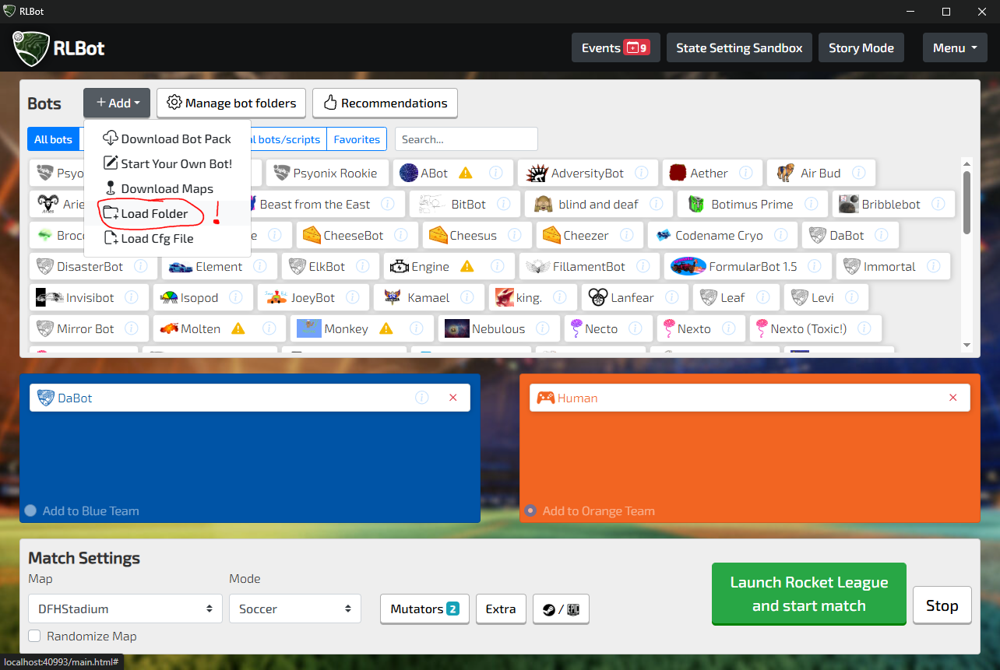

# Rocket League Copy Bot

F5 - Record

F4 - Save recording

F6 - Replay recording

F3 - Replay then record

F8 - Toggle text

F7 - Export recorded replay

F9 - Import replay from file

## How to use

1. Download and install RLBot from https://rlbot.org/.
2. Open RLBot and import this bot folder.
3. Add Rocket League Copy Bot to a match.
4. Use the hotkeys above to record, save, replay, export, or import replays.

